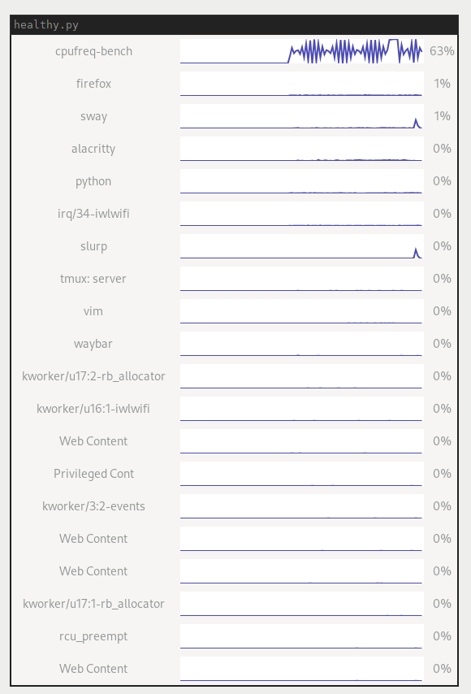

# healthy - a tiny Linux process monitor

Inspired by [Vitals](https://hmarr.com/blog/vitals/), I present to you
`healthy`, which attempts to do the same, only for Linux.

It's a little system monitor that keeps track of cpu, memory, network¹ ²
and io usage for the last minute.  When something is misbehaving, you
can now look for it and see who was spinning up your fans.

¹ Network metrics currently only work for the current user, so system
processes like updates are not included yet.

² Network metrics currently only include TCP traffic, so UDP-based
traffic is not accounted for.



## Installation

On Arch Linux, this can be installed as `healthy-git` from the
[AUR](https://wiki.archlinux.org/index.php/Arch_User_Repository):
https://aur.archlinux.org/packages/healthy-git.

### Run in background using Sway

With [sway](https://github.com/swaywm/sway) it is possible run `healthy` in the
background in a "scratchpad" like the following:

```
# ~/.config/sway/config

for_window [app_id="healthy"] {
	floating enable
	move to scratchpad
}

exec healthy
```

This starts `healthy` in the background when sway starts and then calls the
window to the front using the [keybindings or commands](https://github.com/swaywm/sway/blob/1.6.1/config.in#L162-L173)
for the scratchpad:

## Development

To run this locally, clone the repository and run `python healthy.py`.

If there are missing dependencies, try the `./scripts/run` script.  This
script will install dependencies to a local `virtualenv` and then run
the application.

## License

`healthy` is licensed under GPLv3, see [`LICENSE`](./LICENSE) for
details.
