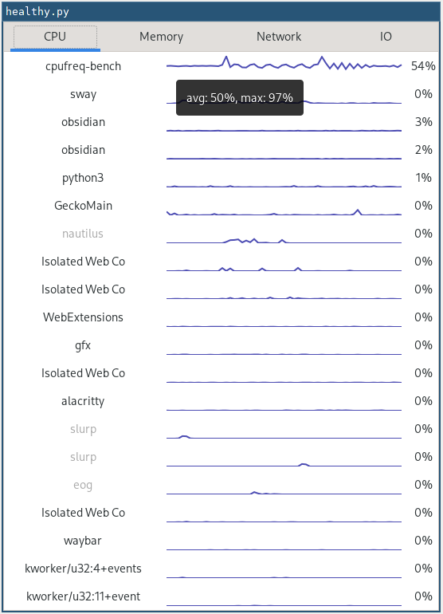

# healthy - a tiny Linux process monitor

Inspired by [Vitals](https://hmarr.com/blog/vitals/), I present to you
`healthy`, which attempts to do the same, only for Linux.

## License

`healthy` is licensed under GPLv3, see [`LICENSE`](./LICENSE) for
details.
